I'm trying to predict where people are likely to perceive that a transition between two neighborhoods.
I have been collecting data from Craiglists about which neighborhood real estate listings claim to be in. I take
these data, do some processing, and identify different neighborhood areas. I then find the borders between these areas
and that is my target data. (the 'pixels' in this case are populated US Census blocks). 


Ultimately, this is a vector that has the length of the number of edges between adjoining census blocks. [This vector](images/data/border.csv) 
takes a value of 1 if this edge is a border between two different neighborhoods and a 0 otherwise. 

I then calculated a number feaures about these edges: do they intersect a [railroad line](images/data/rail_intersects.csv), what is the [difference in 
the racial distribution of the blocks](images/data/js_race.csv), etc. I then use [weighted logistic regression](logistic.R) to build a model
of the probability that an edge between two census blocks will be a border between neighborhoods. Right now,
the probabilty of an edge being a border is treated as if it were independent of other edges being borders. 

### Current model predictions

The below image shows the predicted values from the model. The bright red lines are edges that have an estimated probability
of being a neighborhood boundary over 0.4. The darker red lines have an estimated probability of being borders between
0.3 and 0.4. 

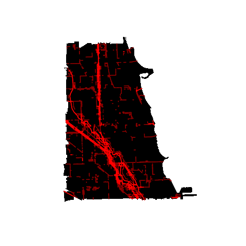

#### Nested models

Using dummy variables, I'm conceptually estimating two different models, one for edges
between uninhabited census blocks where I use physical and administrative features and a richer model for edges
between inhabited census blocks, where I use census features.

```
                                Estimate Std. Error z value Pr(>|z|)    
(Intercept)                      1.96099    0.35298   5.556 2.77e-08 ***
sufficent_pop                   -3.49302    1.75484  -1.991  0.04653 *  
rail                            -1.38279    0.20262  -6.825 8.82e-12 ***
highway                         -0.21385    0.17798  -1.201  0.22956    
water                           -0.78463    0.28082  -2.794  0.00521 ** 
elementary_school               -0.33726    0.12053  -2.798  0.00514 ** 
high_school                     -0.33620    0.19207  -1.750  0.08005 .  
block_angle                     -0.01052    0.04526  -0.232  0.81619    
sufficent_pop:js_age            -0.56444    0.88749  -0.636  0.52478    
sufficent_pop:js_family         -0.54672    1.01693  -0.538  0.59084    
sufficent_pop:js_race            2.32905    0.73664   3.162  0.00157 ** 
sufficent_pop:js_housing         1.06039    1.36470   0.777  0.43715    
sufficent_pop:rail               0.04568    0.52970   0.086  0.93129    
sufficent_pop:highway            3.80162    1.54043   2.468  0.01359 *  
sufficent_pop:water             -0.86476    0.74687  -1.158  0.24693    
sufficent_pop:elementary_school -0.34485    0.19919  -1.731  0.08340 .  
sufficent_pop:high_school        0.10536    0.32713   0.322  0.74740    
sufficent_pop:block_angle        0.02003    0.07438   0.269  0.78772 
```

#### Weighting

Because the vast majority of edges between blocks are not borders between neighborhoods, I can improve model
performance by upweighting rarer positive examples. I choose this weight very naively now, but will use some form 
of cross validation later.

### Segmentation
This model leads to the following segmentation with Felzenszwalb and Huttenlocher's algorithm (scale = 1). 


## Visualizations of features
### Elementary School Attendance Areas: 
* Blue -- border of attendance area
* Green -- border of neighborhood
* Cyan -- overlap of feature and border
 

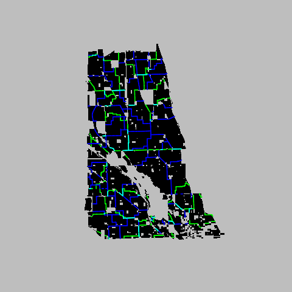

### High School Attendance Areas: 
* Blue -- border of attendance area
* Green -- border of neighborhood
* Cyan -- overlap of feature and border
 

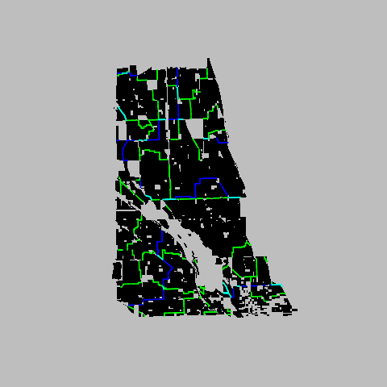

### Major Streets: 
* Blue -- Major street
* Green -- border of neighborhood
* Cyan -- overlap of feature and border
 


 
### River: 
* Blue -- River
* Green -- border of neighborhood
* Cyan -- overlap of feature and border
 


### Railroad: 
* Blue -- Rail Line
* Green -- border of neighborhood
* Cyan -- overlap of feature and border
 


### Land use zoning 
* Blue -- Edge of land use zone (commerical, industrial, residential)
* Green -- border of neighborhood
* Cyan -- overlap of feature and border
 


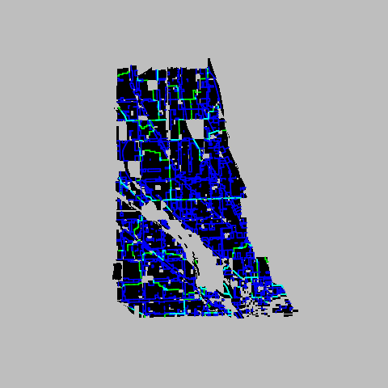

### Race 
Low--tan to High--red

Distance is [Jensen Shannon Divergence](http://en.wikipedia.org/wiki/Jensen%E2%80%93Shannon_divergence)

Percent Hispanic

 

Percent Black

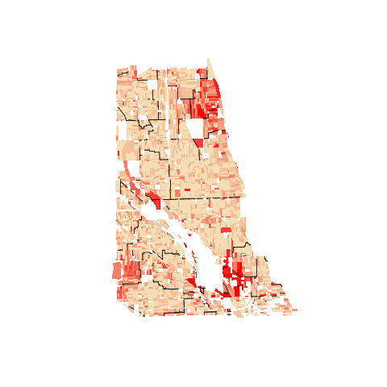

Percent White

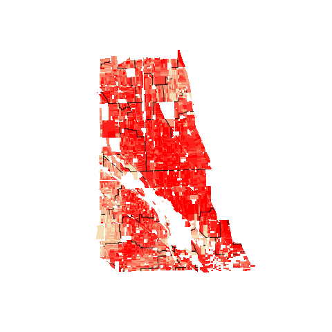

Percent Asian

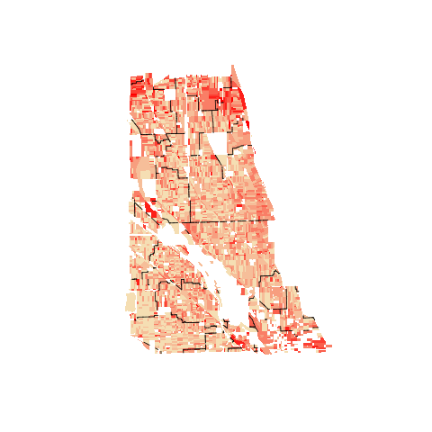

### Age
Low--tan to High--red

Distance is [Jensen Shannon Divergence](http://en.wikipedia.org/wiki/Jensen%E2%80%93Shannon_divergence)


Percent Preschool Age

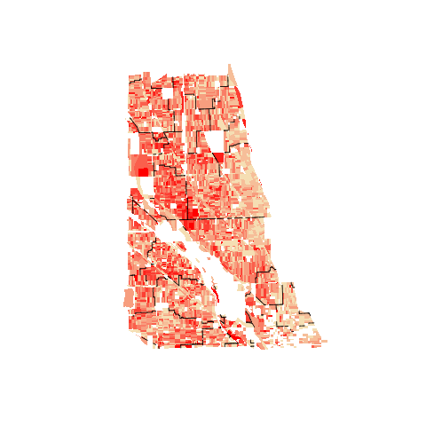 

Percent School Age

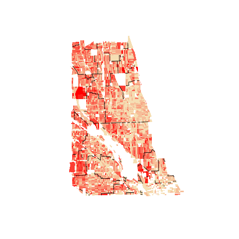

Percent College Age

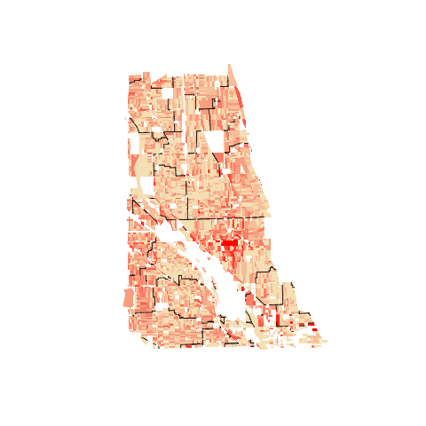

Percent Young Adult

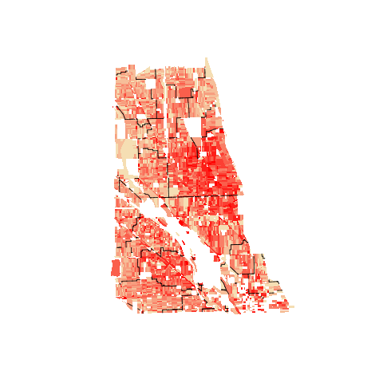

Percent Middle Age

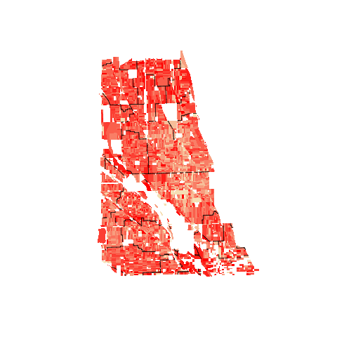

Percent Retirement Age

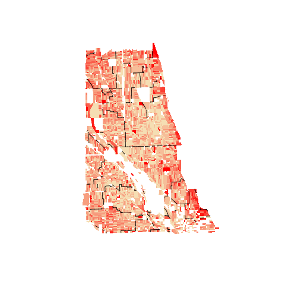

### Family Type
Low--tan to High--red

Distance is [Jensen Shannon Divergence](http://en.wikipedia.org/wiki/Jensen%E2%80%93Shannon_divergence)


Percent Husband and Wife

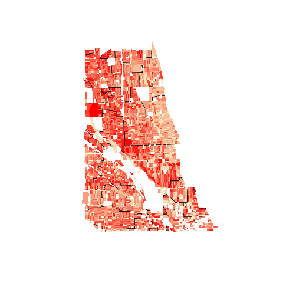 

Percent Single Dad

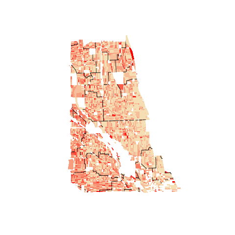 

Percent Single Mom

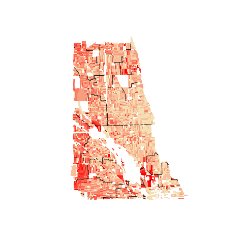 

Percent Live alone

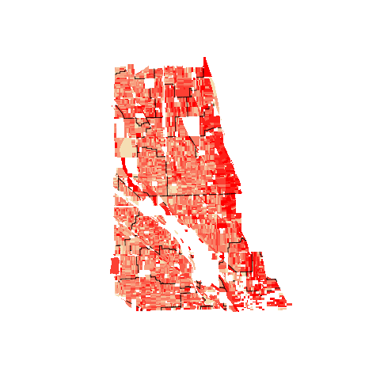 

Percent Living with Roommates

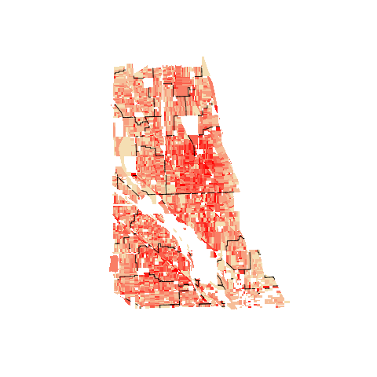 

### Block Orientation

Distance is absolute difference in angles (radians)

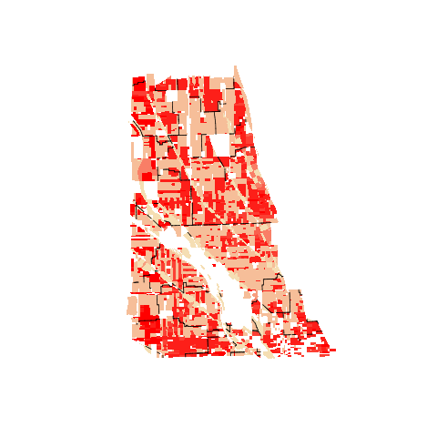 
