I'm trying to predict where people are likely to perceive that a transition between two neighborhoods.
I have been collecting data from Craiglists about which neighborhood real estate listings claim to be in. I take
these data, do some processing, and identify different neighborhood areas. I then find the borders between these areas
and that is my target data. (the 'pixels' in this case are populated US Census blocks). 

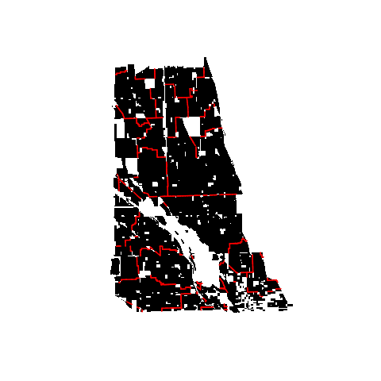

Ultimately, this is a vector that has the length of the number of edges between adjoining census blocks. [This vector](data/border.csv) 
takes a value of 1 if this edge is a border between two different neighborhoods and a 0 otherwise. 

I then calculated a number feaures about these edges: do they intersect a [railroad line](data/rail_intersects.csv), what is the [difference in 
the racial distribution of the blocks](data/js_race.csv), etc. I then use pystruct to try to build a model of where these borders will occur
based on these features and pairwise connections between edges to encourage longer lines. 

However, as you can see in the figure below, this is not working very well. 

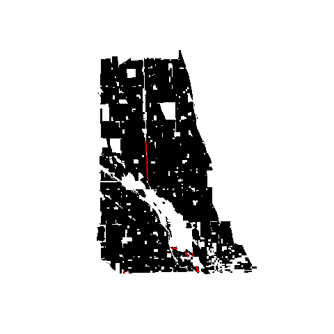

I believe that this is, in part, because of the sharpness of the default hamming loss in pystruct. I would like to use a
loss function that gave some credit for partitions that were 'close' to training data. I'm not quite decided on how
to best operationalize closeness.

## Visualizations of features
### Elementary School Attendance Areas: 
* Blue -- border of attendance area
* Green -- border of neighborhood
* Cyan -- overlap of feature and border
 

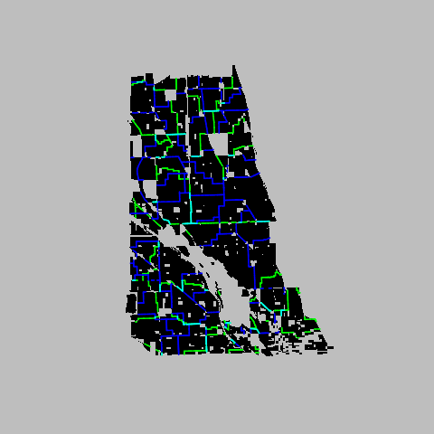

### High School Attendance Areas: 
* Blue -- border of attendance area
* Green -- border of neighborhood
* Cyan -- overlap of feature and border
 

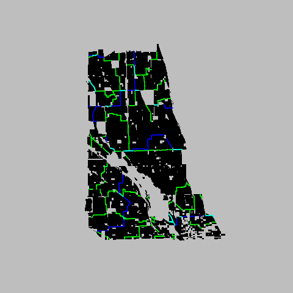

### Major Streets: 
* Blue -- Major street
* Green -- border of neighborhood
* Cyan -- overlap of feature and border
 

 
### River: 
* Blue -- River
* Green -- border of neighborhood
* Cyan -- overlap of feature and border
 

### Railroad: 
* Blue -- Rail Line
* Green -- border of neighborhood
* Cyan -- overlap of feature and border
 

### Land use zoning 
* Blue -- Edge of land use zone (commerical, industrial, residential)
* Green -- border of neighborhood
* Cyan -- overlap of feature and border
 

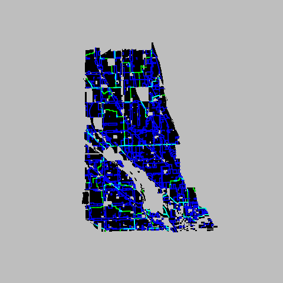

### Race 
Low--tan to High--red

Distance is [Jensen Shannon Divergence](http://en.wikipedia.org/wiki/Jensen%E2%80%93Shannon_divergence)

Percent Hispanic

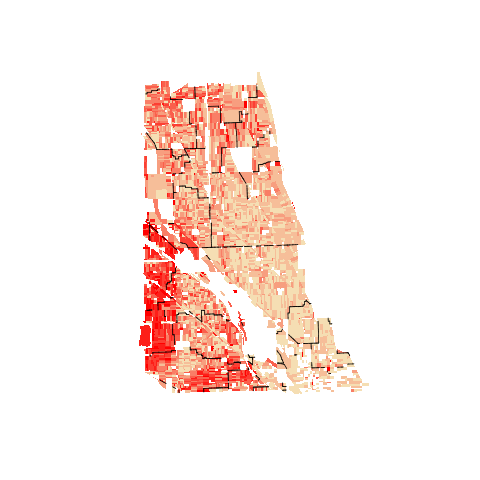 

Percent Black

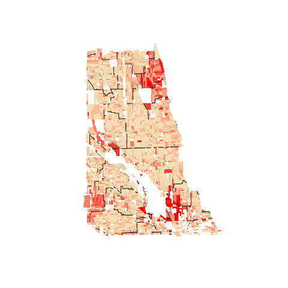

Percent White

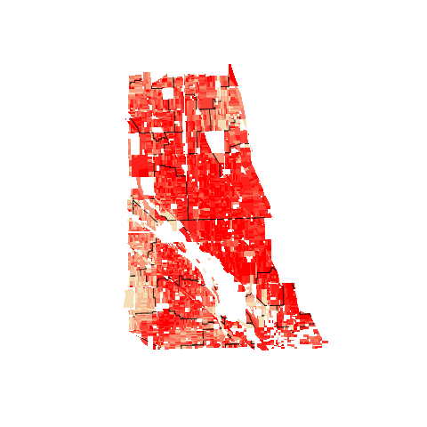

Percent Asian

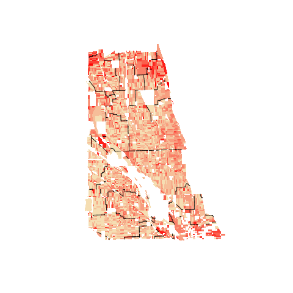

### Age
Low--tan to High--red

Distance is [Jensen Shannon Divergence](http://en.wikipedia.org/wiki/Jensen%E2%80%93Shannon_divergence)

Percent Preschool Age

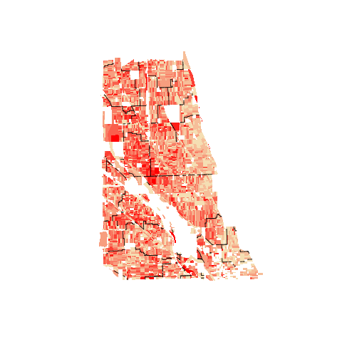 

Percent School Age

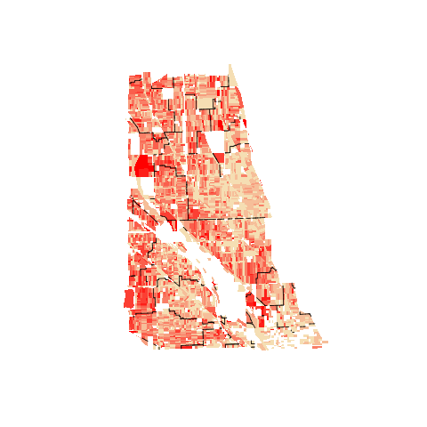

Percent College Age

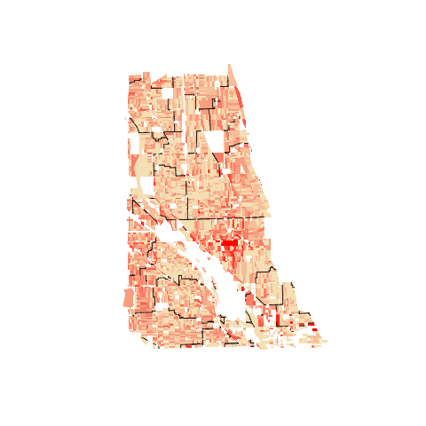

Percent Young Adult

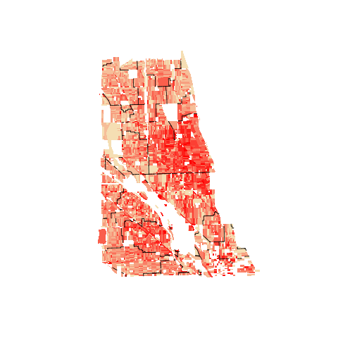

Percent Middle Age

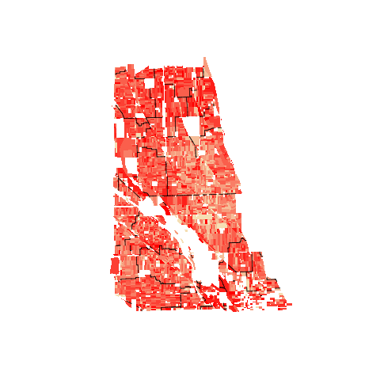

Percent Retirement Age

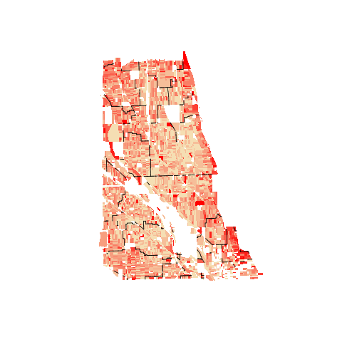

### Family Type
Low--tan to High--red

Distance is [Jensen Shannon Divergence](http://en.wikipedia.org/wiki/Jensen%E2%80%93Shannon_divergence)

Percent Husband and Wife

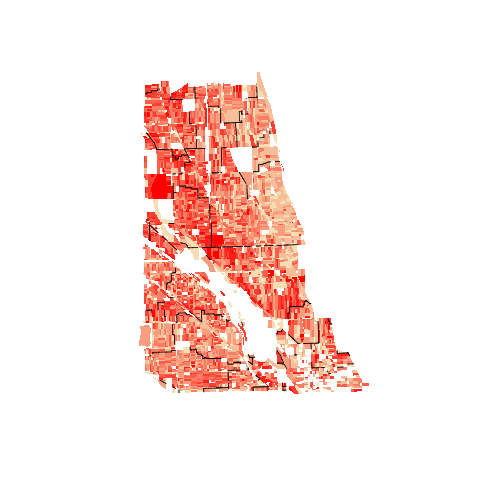 

Percent Single Dad

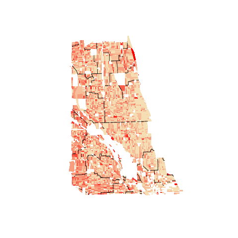 

Percent Single Mom

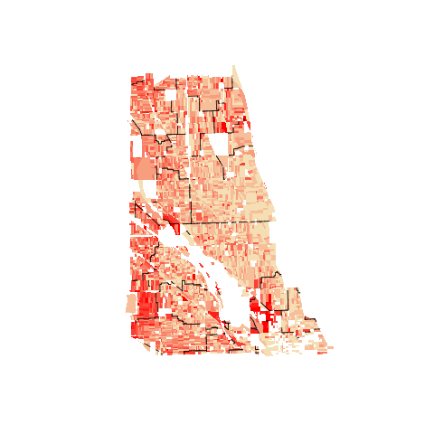 

Percent Live alone

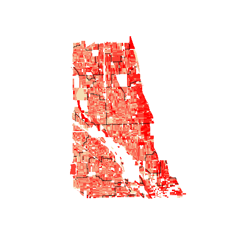 

Percent Living with Roommates

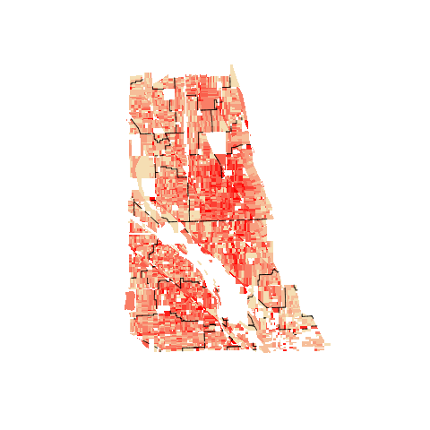 

### Block Orientation

Distance is absolute difference in angles (radians)

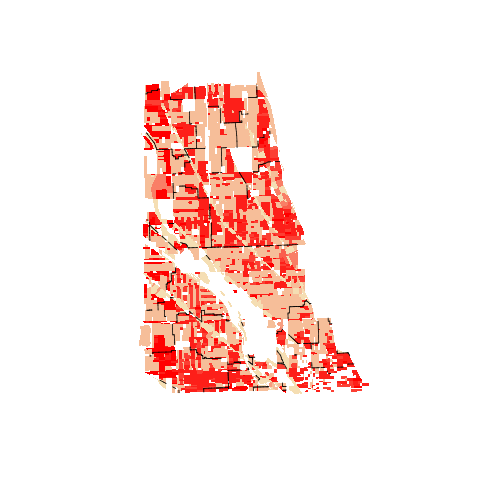 
